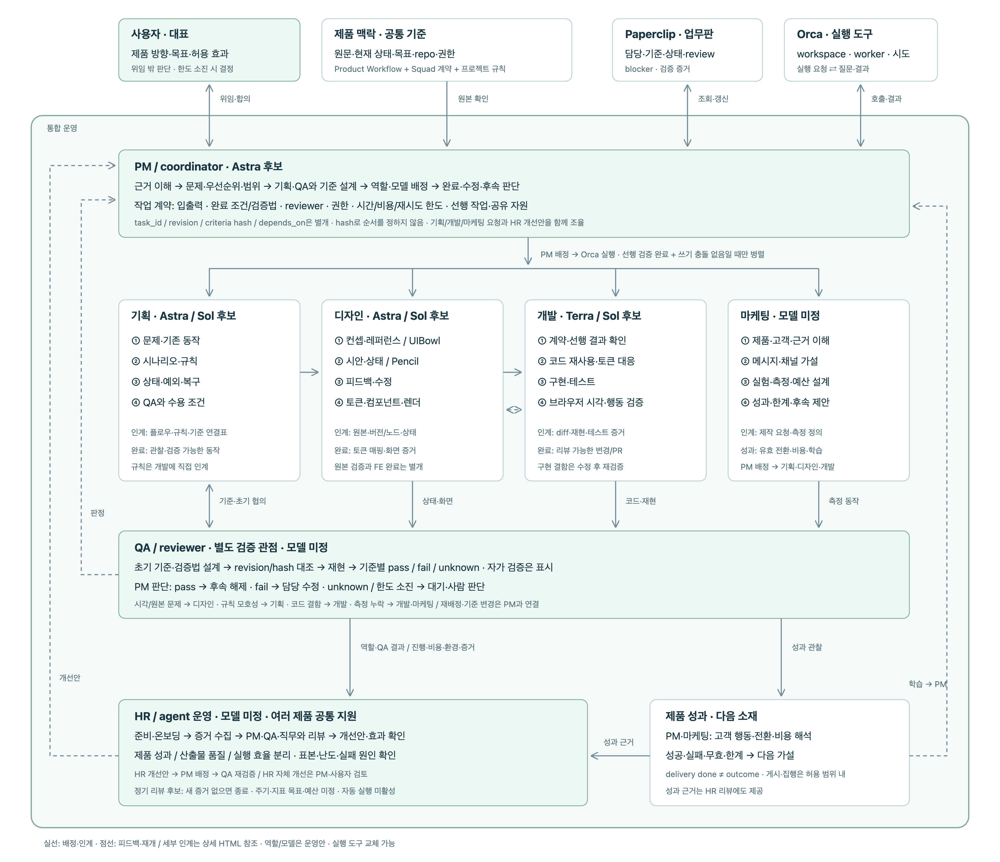

# Personal Orchestration

여러 제품의 업무를 PM 중심으로 조율하는 개인 오케스트레이션 모델.
**PM이 배정하고, Paperclip에 기록하고, Orca에서 실행합니다.**

## 업무 흐름



[이미지 확대](docs/images/model-process.png) · [상세 흐름도](tasks/model-process.html)

**제품 맥락·도구 → PM → 기획·디자인·개발·마케팅 → QA → HR 리뷰·제품 성과 → PM**

## 역할과 모델

| 역할 | 업무 → 인계 | 모델 후보 |
| --- | --- | --- |
| 사용자 | 방향·목표·허용 범위 → PM | — |
| PM | 문제·우선순위·계약·배정 → 역할별 작업·후속 판단 | Astra |
| 기획 | 시나리오·규칙·예외 → 디자인 플로우·개발 규칙·QA 기준 | Astra / Sol |
| 디자인 | 컨셉·레퍼런스·시안·토큰 → 원본·상태·매핑·렌더 증거 | Astra / Sol |
| 개발 | 코드 재사용·구현·테스트 → 리뷰 가능한 변경·재현 증거 | Terra / Sol |
| QA | 초기 기준 설계·독립 검증 → 기준별 판정·수정 요청 | 미정 |
| 마케팅 | 고객·메시지·채널 실험 → 제작 요청·성과·학습 | 미정 |
| HR / agent 운영 | 온보딩·준비 확인·공동 리뷰 → 개선안·효과 추적 | 미정 |

모델은 배정 후보입니다. 필요한 역할만 실행하며, 자가 검증은 별도로 표시합니다.

## 업무 프로세스

1. **소재:** 원문 근거 수집, 관찰·해석·가설 구분.
2. **조율:** PM이 문제·사용자·성과 지표·우선순위·범위 정리.
3. **계약:** 완료 조건·검증법·reviewer·허용 효과·한도 합의.
4. **배정:** 선행 검증 완료 + 공유 자원 충돌 없음이면 병렬 착수.
5. **실행:** 역할별 상세 작업 → 산출물·질문·남은 일 인계.
6. **검증:** pass → 완료, fail → 담당 수정, unknown → 대기·판단.
7. **학습:** 후속 작업 해제 → 실제 성과 확인 → 다음 소재.
8. **개선:** HR이 역할·QA의 근거를 공동 리뷰 → PM 개선 배정 → QA 재검증.

**계약 원칙:** 안정적인 `task_id` / 기준 `revision·hash` / `depends_on` 분리.
기준 변경 시 증거 재검토, 기존 권한의 반복 승인 금지, delivery와 outcome 구분.

## 여러 제품과 실행 도구

**공통 PM 조율 → 제품별 프로젝트·repo·workspace → 필요한 역할 실행.**

| 구분 | 책임 |
| --- | --- |
| PM + 프레임워크 | 제품 간 우선순위·공유 자원·역할·완료 기준 조율 |
| Paperclip | 업무 단위의 담당·상태·blocker·review·증거 |
| Orca | 제품별 worker 배치·실행 시도·질문과 결과 전달 |
| 제품 repo | 상세 체크리스트·설계·코드·검증 산출물 |

업무 계약은 도구와 분리합니다. 자체 scheduler는 없으며, 제품 간 자동 실행은 미검증입니다.

## 주기 점검 루프

**성과 개선:** 역할·QA 증거 → HR이 PM·직무와 리뷰 → PM 개선 배정 → QA 재검증.
제품 성과·산출물 품질·실행 효율을 분리하며, HR의 개선 효과는 PM·사용자가 검토합니다.
[역할별 지표·리뷰 기준](docs/role-performance.md)은 운영안이며 목표치·리뷰 주기는 미정입니다.

**이벤트·주기 점검 → 변경 확인 → PM 판단 → 실행/대기 → 검증·기록.**

새 일 없으면 종료, 활성 작업은 중복 실행 금지. 주기·비용·시간·재시도 한도는 **미정·미활성**입니다.

## 현재 상태

이 repo의 문서 작업으로 **PM 편집 → 독립 Codex QA → HR 리뷰**를 한 번 실행했습니다.
계약·테스트 검사 통과, 표현 3곳 수정, 운영 개선안 2개를 기록했습니다. [시범 결과](tasks/first-live-pilot.md)

| 구분 | 상태 |
| --- | --- |
| Paperclip 로컬 설치·UI·재시작 상태 보존 | 검증 완료 |
| 역할 지침·완료 기준·인계 계약 | 구성 완료 |
| 제안 계약 5개·무료 process probe | 검사 완료 |
| Paperclip 기록 + Orca 단발 QA·HR 실행 | 검증 완료 · PM이 상태 연결 |
| 디자인 도구 | Pencil 연결 확인 / UIBowl 인증 미완료 |
| 실제 다중 agent 제품 수행·자동 배정 | 미검증 |
| 상시 실행·주기 루프 | 미활성 |

## 설치·실행

**요구 환경:** Git·fnm·Python 3·기존 PostgreSQL·운영자 공통 workflow 문서.
검증 환경: macOS arm64 / Node 24.21.0 / PostgreSQL 16.15.

```sh
./scripts/install-paperclip
# 전용 DB·환경 설정: 아래 설치 가이드 참조
./scripts/paperclip run --no-repair
```

접속: <http://127.0.0.1:13100/ORC/issues> · 중지: 서버 터미널에서 `Ctrl-C`

[설치 가이드](docs/local-setup.md)에서 전용 DB·환경 설정을 먼저 완료하세요. clone만으로 실행 환경이 완성되지는 않습니다.

## 검증

```sh
python3 scripts/check-contracts.py examples/pilot.json
python3 -m unittest discover -s tests -v
```

계약 검사는 실제 agent 수행·제품 성과 검증과 별개입니다.

## 문서·데이터

| 문서 | 내용 |
| --- | --- |
| [운영 모델](docs/operating-model.md) | 역할·업무 순서·도구 책임 상세 |
| [Squad Model skill](skills/squad-model/SKILL.md) | 재사용 가능한 역할·작업·인계 계약 |
| [설치·검증](docs/local-setup.md) | DB·환경·도구 연결·알려진 한계 |
| [샘플 계약](examples/pilot.json) | v1 제안 작업 5개 |
| [작업 기록](tasks/personal-model.md) | 결정·검증 근거 |

공통 행동 규칙은 운영자의 global wiki가 소유합니다. 비밀·인증·runtime·로그·`.ideas/`는 Git에서 제외합니다.
