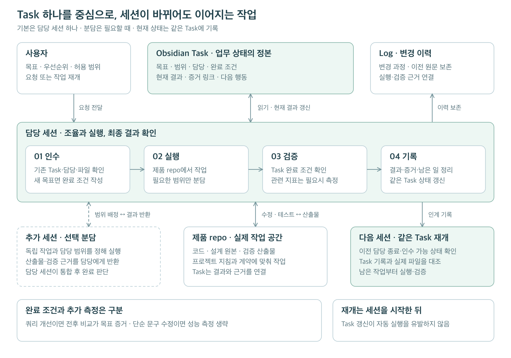
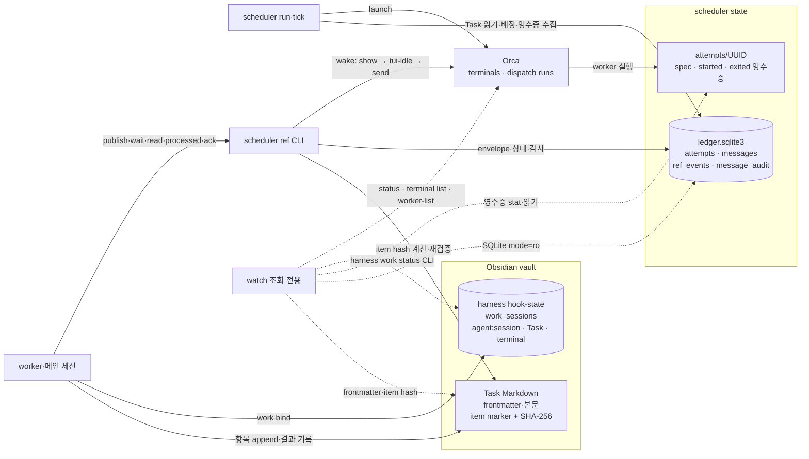
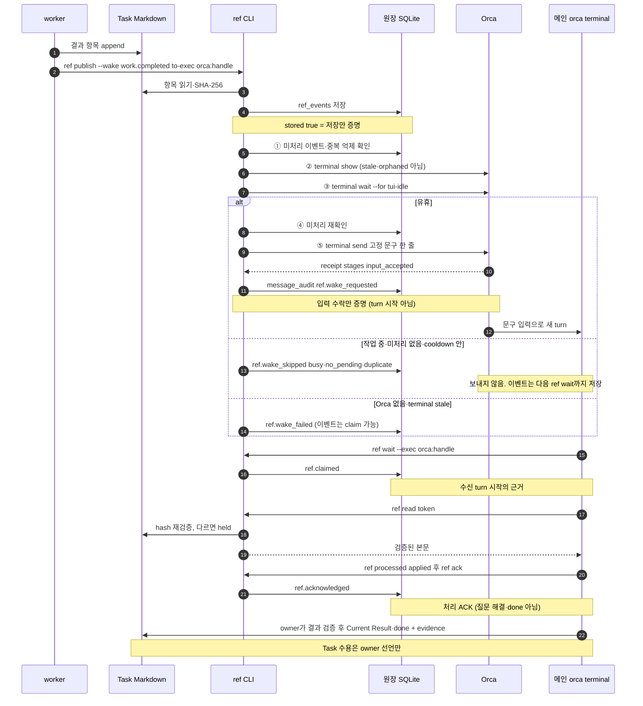

# Orchestration

AI 세션으로 제품 작업을 진행하고, 그 맥락을 Obsidian에 모아 이어가는 운영 구조다. **Task 하나 + 담당 세션 하나**를 기본으로, 목표·완료 조건·현재 결과·다음 행동을 같은 Task에 남긴다.

담당 세션이 조율과 실행을 함께 맡는다. 독립적으로 나눌 이득이 있을 때만 추가 세션을 활용하고, 최종 결과는 담당 세션이 확인한다.

## 동작 흐름

[](docs/images/task-session-flow.png)

[SVG 원본](docs/images/task-session-flow.svg)

1. **인수** — 기존 Task와 실제 파일, 현재 담당을 확인한다. 새 업무라면 요청을 받은 세션이 목표·범위·완료 조건을 작성한다.
2. **실행** — 제품 repo에서 작업한다. 분담이 필요하면 작업 범위와 담당을 정하고 산출물·검증 근거를 돌려받는다.
3. **검증** — 처음 정한 완료 조건으로 결과를 확인한다. 목표나 변경 영향에 맞는 성능 지표도 필요한 경우 함께 측정한다.
4. **기록** — 같은 Task에 현재 결과·증거·다음 행동을 갱신한다. 다음 세션은 이 기록과 실제 파일을 대조해 남은 일을 이어간다.

## 완료 조건과 성능 측정

완료 조건은 **그 Task가 달성하려는 결과**다. BE·FE 지표를 모든 작업의 공통 통과 기준으로 적용하지 않는다.

| 작업 예시 | 완료를 확인할 근거 | 함께 살펴볼 측정 |
| --- | --- | --- |
| DB 쿼리 성능 개선 | 결과·권한 유지, 같은 조건에서 전후 성능 개선 확인 | 쿼리 시간·실행 계획·쿼리 수 |
| 화면 로딩 개선 | 목표 화면의 로딩 개선과 기능 유지 | LCP·요청 수·번들 크기 중 관련 항목 |
| 문구·단순 UI 수정 | 요청한 표현·동작·레이아웃 확인 | 성능 영향이 없으면 생략 |

성능 개선 자체가 목표이면 측정이 목표 달성의 근거가 된다. 그 외 추가 측정은 영향과 후속 개선을 판단하는 자료로 기록한다. [측정 선택·해석 기준](docs/engineering-measurement.md)

## 구성

| 구성 | 역할 |
| --- | --- |
| Obsidian Task | 업무 상태의 정본. 목표·담당·완료 조건·현재 결과·다음 행동 |
| 제품 repo · Agent | 코드·설계·검증 산출물이 있는 실제 작업 공간과 실행자 |
| Harness · Log | 관측된 변경을 세션·Task·증거에 연결하고 변경 이력을 보존 |
| Orca · 선택 | 추가 세션 실행과 결과 전달. 업무 상태는 중앙 Task에 연결 |

현재 상태는 Task, 산출물은 제품 repo, 변경 이력은 Log에 둔다. 별도 보드나 진행 문서에 같은 상태를 중복 관리하지 않는다.

## 사용법 · Obsidian에서 프로젝트 운용하기

**Obsidian vault 폴더에서 AI 세션을 열고 담당 프로젝트를 지정한다.** Obsidian은 공통 작업 기록 공간이고, 실제 코드 수정·서버 실행·테스트는 지정한 제품 repo에서 수행한다. 제품 repo에서 직접 세션을 시작해도 같은 Task를 사용할 수 있다.

### 1. 프로젝트 연결 확인

프로젝트 등록부에 **repo 경로와 중앙 문서 위치**가 연결돼 있어야 한다. 프로젝트 index는 목적·우선순위와 지침·실행 안내를 연결하고, Task는 담당·완료 조건·진행 상태를 소유한다. 새 프로젝트는 이 연결부터 설정한다. 별도의 프로젝트 목록이나 진행 보드를 중복 작성하지 않는다.

중앙 harness가 설치된 vault에서 연결을 확인한다. 이 명령은 조회이며 프로젝트 등록이나 작업 실행을 하지 않는다.

```sh
uv run python -m harness context /absolute/product/repo
```

### 2. 목표를 주고 시작

> Laughtale 프로젝트를 맡아줘. 등록된 repo와 프로젝트 지침, 기존 Task·담당을 확인해. 목록 쿼리 개선을 진행하고 결과·권한은 유지하면서 전후 시간을 비교해줘.

세션이 대상을 확인하고 기존 Task를 인수하거나 새 Task를 작성한다. 프로젝트가 여러 개로 해석되거나 경로가 없으면 해당 정보부터 확인한다. 코드 변경은 해당 제품 repo에서 시작한 실행 세션에 연결하고, 중앙 기록 명령은 vault에서 실행한다. 현재 harness는 세션의 repo를 고정하므로 Obsidian 세션에서 `cd`만 바꿔 제품 코드 변경을 기록하지 않는다.

### 3. 세션을 나누거나 이어가기

| 상황 | 요청 예시 |
| --- | --- |
| 프로젝트별 세션 분리 | “이 세션은 프로젝트 A만 담당해. 프로젝트 B는 다른 세션에서 진행할게.” |
| 기존 작업 재개 | “프로젝트 A의 Task `<ID 또는 경로>`를 이어가줘. 이전 담당과 실제 파일 상태부터 확인해.” |
| 현재 상태 확인 | “프로젝트 A의 완료한 일·남은 일·막힌 이유를 Task 기준으로 알려줘.” |

Obsidian에서 여러 세션을 열어도 **각 세션의 대상 repo·Task·담당 범위는 구분**한다. 같은 Task·파일이나 공유 DB·포트에 겹쳐 작업하지 않도록 확인한다. Task를 갱신하는 것만으로 다른 세션이 자동 실행되지는 않는다.

중앙 wiki·harness는 clone에 포함되지 않는 [외부 환경](docs/external-dependencies.md)이다. Obsidian에서 시작한 세션의 다른 repo 편집 권한과 hook의 작업 기록 연결은 실제 환경에서 확인해야 한다. 현재 검증만으로 여러 프로젝트 세션의 자동 격리를 보장하지 않는다.

## 선택적 compact scheduler

일상 배정과 결과 수집은 Python이 맡고, 우선순위 충돌·연결 작업 유입·계획 변경에만 메인 LLM을 호출한다. 기존 Markdown Task를 정본으로 쓰며 두 프로젝트도 하나의 실행 슬롯과 원장을 공유한다. 로컬 명령과 Orca terminal adapter를 지원한다.

`uv sync --locked` 후 승인된 프로젝트·worker 명령을 설정하고 `uv run python -m scheduler --config .runtime/scheduler.json --state .runtime/scheduler run`으로 수동 시작한다. 실행 중단 후에는 같은 state 경로로 재시작한다. 실행 여부가 불명확하면 자동 재시도하지 않으며 종료와 Task 수용을 구분한다.

조회 전용 `watch`는 대기·문제·진행·세션 네 구역을 보여 주며 `--project`로 거르고 `--json`으로 같은 데이터를 낸다. 세션은 `--harness-root`를 준 경우 harness 공개 CLI에서 읽는다. 마지막 활동은 CLI 세션 파일 mtime(stat만)이고, live Orca terminal·dispatch는 조회용 명령으로 읽으며 기록된 근거가 있을 때만 세션에 연결한다([watch](docs/project-scheduler.md#터미널-진행-조회-watch)).

메인 감독 아래 worker의 질문·답변·막힘·완료는 기존 Task에 추가한 항목과 SQLite 참조 이벤트(`ref publish/wait/read/processed/ack`)로 주고받는다([운영 모델](docs/task-session-model.md#메인-감독과-worker-질문재개완료)). 수신자가 활성 세션에서 기다려야 전달되며, Task 수정만으로 자동 publish되지 않고 승인 대기 hook·일반 TUI의 scheduler 통합은 없다. idle wake는 수신 실행이 `orca:<terminal handle>`일 때 `ref publish --wake`/`ref wake`로 유휴 terminal에 고정 문구 한 번을 보내는 best effort뿐이다(작업 중이면 보내지 않음, receipt는 입력 수락만 증명; 제품 코드의 실제 유휴 메인 재개는 미검증, [wake](docs/scheduler-task-events.md#유휴-orca-수신자-wakebest-effort)). 실제 왕복은 Claude·Kiro에서 확인했고 Codex worker는 검증되지 않았다.

[설정·Task 계약·복구](docs/project-scheduler.md) · [대상별 지시·처리 ACK](docs/scheduler-messaging.md) · [Task 배정·인수 ACK](docs/scheduler-assignment.md) · [Task 항목 참조 이벤트](docs/scheduler-task-events.md) · [검증 범위](docs/project-scheduler-validation.md). 자동 게시와 daemon 설치는 포함하지 않는다.

### 내부 동작 · 원장·참조 이벤트·wake·watch·세션 연결

정본은 셋으로 나뉜다. **업무 상태는 Task Markdown**, **실행·전달 상태는 scheduler 원장(SQLite)**, **세션과 Task·terminal의 연결은 harness `work_sessions`**에 둔다. Orca는 terminal과 dispatch 실행을 제공할 뿐 업무 상태를 소유하지 않는다. `watch`는 넷을 모두 읽기만 하고 아무것도 쓰지 않는다.


```mermaid
flowchart LR
    P["worker·메인 세션"]
    subgraph VAULT["Obsidian vault"]
        T["Task Markdown<br/>frontmatter·본문<br/>item marker + SHA-256"]
        H[("harness hook-state<br/>work_sessions<br/>agent:session · Task · terminal")]
    end
    subgraph STATE["scheduler state"]
        DB[("ledger.sqlite3<br/>attempts · messages<br/>ref_events · message_audit")]
        AT["attempts/UUID<br/>spec · started · exited 영수증"]
    end
    O["Orca<br/>terminals · dispatch runs"]
    S["scheduler run·tick"]
    R["scheduler ref CLI"]
    W["watch 조회 전용"]

    P -->|"항목 append·결과 기록"| T
    P -->|"work bind"| H
    P -->|"publish·wait·read·processed·ack"| R
    S -->|"Task 읽기·배정·영수증 수집"| DB
    S -->|"launch"| O
    O -->|"worker 실행"| AT
    R -->|"item hash 계산·재검증"| T
    R -->|"envelope·상태·감사"| DB
    R -->|"wake: show → tui-idle → send"| O
    W -.->|"frontmatter·item hash"| T
    W -.->|"SQLite mode=ro"| DB
    W -.->|"영수증 stat·읽기"| AT
    W -.->|"harness work status CLI"| H
    W -.->|"status · terminal list · worker-list"| O
```

- **참조 이벤트:** 본문은 Task 항목에만 있고 원장 `ref_events`에는 Task·item ID·hash와 전달 상태만 둔다. claim·read·processed 때마다 hash를 다시 계산해 다르면 내용을 주지 않고 `held`로 둔다. 전달은 수신자가 `ref wait/claim`하는 pull이다([참조 이벤트](docs/scheduler-task-events.md)).
- **idle wake:** 수신 실행이 `orca:<terminal handle>`일 때만, 유휴 terminal에 원장 명령이 담긴 고정 문구 한 줄을 한 번 보낸다. 이벤트 상태는 바꾸지 않고 결과만 `message_audit`에 남긴다.
- **세션·terminal 연결:** `work bind`가 `ORCA_TERMINAL_HANDLE`(또는 `--terminal`)을 `orca:<handle>`로 기록하고, `watch`는 이 값이 live Orca handle과 정확히 같을 때만 세션과 terminal을 잇는다. 근거가 없으면 `session unknown`이다([watch](docs/project-scheduler.md#세션-대기문제진행-조회)).

worker 완료 보고부터 Task 수용까지 한 번의 왕복은 다음과 같다. 단계마다 증명하는 범위가 다르다.


```mermaid
sequenceDiagram
    autonumber
    participant WK as worker
    participant T as Task Markdown
    participant C as ref CLI
    participant DB as 원장 SQLite
    participant O as Orca
    participant M as 메인 orca terminal

    WK->>T: 결과 항목 append
    WK->>C: ref publish --wake work.completed to-exec orca:handle
    C->>T: 항목 읽기·SHA-256
    C->>DB: ref_events 저장
    Note over C,DB: stored true = 저장만 증명
    C->>DB: ① 미처리 이벤트·중복 억제 확인
    C->>O: ② terminal show (stale·orphaned 아님)
    C->>O: ③ terminal wait --for tui-idle
    alt 유휴
        C->>DB: ④ 미처리 재확인
        C->>O: ⑤ terminal send 고정 문구 한 줄
        O-->>C: receipt stages input_accepted
        C->>DB: message_audit ref.wake_requested
        Note over C,O: 입력 수락만 증명 (turn 시작 아님)
        O->>M: 문구 입력으로 새 turn
    else 작업 중·미처리 없음·cooldown 안
        C->>DB: ref.wake_skipped busy·no_pending·duplicate
        Note over O,M: 보내지 않음. 이벤트는 다음 ref wait까지 저장
    else Orca 없음·terminal stale
        C->>DB: ref.wake_failed (이벤트는 claim 가능)
    end
    M->>C: ref wait --exec orca:handle
    C->>DB: ref.claimed
    Note over M,DB: 수신 turn 시작의 근거
    M->>C: ref read token
    C->>T: hash 재검증, 다르면 held
    C-->>M: 검증된 본문
    M->>C: ref processed applied 후 ref ack
    C->>DB: ref.acknowledged
    Note over M,DB: 처리 ACK (질문 해결·done 아님)
    M->>T: owner가 결과 검증 후 Current Result·done + evidence
    Note over M,T: Task 수용은 owner 선언만
```

`input_accepted`는 Orca가 입력을 받았다는 뜻일 뿐이다. turn 시작은 수신자의 이후 `ref.claimed`로, 처리는 `ref.acknowledged`로, 완료는 Task owner의 기록으로 각각 따로 확인한다([네 상태 구분](docs/scheduler-task-events.md#유휴-orca-수신자-wakebest-effort)). `watch`는 이 과정의 WAITING·PROBLEMS(held·stale·`wake_failed`·반복 `busy`)를 보여 주지만 CLI 승인 대기는 감지하지 못해 `unsupported`로 표시한다.

## 공통 skill 설치와 사용

[project-orchestrator](skills/project-orchestrator/SKILL.md)가 프로젝트 탐색과 Task 실행 진입을 연결한다. 기존 Orca `orchestration` skill은 필요할 때 제품 실행 세션을 조율하는 도구다.

| 구성 | 위치와 역할 |
| --- | --- |
| skill 원본 | `skills/project-orchestrator/SKILL.md` — 이 repo에서 한 번만 관리 |
| Codex 연결 | `~/.agents/skills/project-orchestrator` → 원본 디렉터리 |
| Claude 연결 | `~/.claude/skills/project-orchestrator` → 같은 원본 디렉터리 |
| Obsidian 진입점 | vault `AGENTS.md`에서 프로젝트 시작·재개·상태 조회 시 skill을 읽도록 연결 |
| 프로젝트 프로필 | 기존 등록부의 repo·문서 위치와 프로젝트 index를 사용 |

이 머신에는 두 연결과 vault 진입 안내를 설정했다. 다른 머신에서는 clone 경로를 실제 경로로 바꾸고 아래처럼 연결한다. 기존 경로가 있으면 덮어쓰지 말고 원본부터 확인한다.

```sh
mkdir -p "$HOME/.agents/skills" "$HOME/.claude/skills"
ln -s /absolute/orchestration/skills/project-orchestrator "$HOME/.agents/skills/project-orchestrator"
ln -s /absolute/orchestration/skills/project-orchestrator "$HOME/.claude/skills/project-orchestrator"
```

vault의 `AGENTS.md`에는 “프로젝트 시작·재개·상태 조회 시 project-orchestrator를 읽는다”는 안내와 실제 skill 경로를 연결한다. Claude의 공통 진입 지침도 해당 프로젝트 `AGENTS.md`를 읽도록 연결돼 있어야 한다. 원본 checkout을 유지하고 새 세션에서 skill 발견 여부를 확인한다.

설정 후 Obsidian에서 새 세션을 열고 요청한다.

> Laughtale의 knowledge-read-optimization Task 상태를 확인해줘.

명시적으로 선택하려면 Codex에서는 `$project-orchestrator`, Claude에서는 `/project-orchestrator`를 사용할 수 있다. skill은 원본의 실제 경로를 기준으로 운영·측정 문서를 읽으며, 프로젝트 목록이나 진행 상태를 복제하지 않는다. Obsidian 세션이 조회·조율하고 제품 repo 세션이 코드 작업을 맡는다. 세션 실행 도구가 없으면 대상 repo·Task를 안내한다.

## 검증 범위

Orca에서 Obsidian 경로로 시작한 Codex·Claude 새 세션이 공통 skill을 읽고 Laughtale의 지정 Task를 조회하는 것을 확인했다. 이는 읽기 전용 진입·프로젝트 연결 검증이며 제품 코드 변경·자동 분담 실행 검증은 아니다.

별도 세션이 같은 Task를 읽고 작업을 인수해 수정·검증·기록하는 흐름을 실제로 확인했다. 중단·기록 재시도·동시 변경 판정은 격리된 회귀 시험으로 확인했다.

기본 Task·세션 흐름은 수동으로 시작한다. 선택적인 [compact scheduler](docs/project-scheduler.md)는 Python 지속 프로세스·공유 SQLite 원장으로 단일 슬롯 자동 배정과 실행 복구를 제공한다. Markdown 작성자 간 동시 쓰기 잠금은 제공하지 않는다. idle wake는 Orca `orca:<handle>` 수신 실행 전용 best effort다. 일회용 Kiro TUI에서 busy skip·orphaned 실패는 실제로 확인했지만, shell에서 시작한 메인 terminal에서는 `tui-idle`이 한 번도 충족되지 않아 유휴 메인이 wake로 실제 재개되는 흐름은 아직 검증하지 않았다. CLI 승인 대기는 감지하지 않는다(`watch`에서 `unsupported`). 세션 종료나 문서 검사 통과만으로 제품 작업의 완료를 판단하지 않는다. [검증 결과와 한계 · 로컬 의존성](docs/external-dependencies.md#local-2)

## 저장소 구성

- `scheduler/` — compact scheduler CLI·실행 원장·adapter·계획 검증
- `skills/project-orchestrator/` — 프로젝트 탐색·Task 실행 진입 skill
- `docs/` — 현재 운영 모델, 측정 기준, 가상 사례와 외부 방식 비교
- `docs/images/task-session-flow.*` — README 구성도와 편집 가능한 SVG 원본
- `skills/squad-model/`, `scripts/`, `examples/`, `tests/` — 이전 역할·계약 중심 실험과 검증 도구

Paperclip 관련 스크립트와 npm 의존성은 이전 실험용으로 보존한다. 현재 Task·세션 모델을 읽고 적용하는 데 Paperclip 설치는 필요하지 않다. 중앙 wiki·harness 연결은 [외부 환경 안내](docs/external-dependencies.md)를 참고한다.

## 상세 문서

[운영 모델](docs/task-session-model.md) · [BE·FE 측정 기준](docs/engineering-measurement.md) · [가상 사례](docs/engineering-measurement-simulation.md) · [기록·복구 · 로컬 의존성](docs/external-dependencies.md#local-3) · [외부 방식 비교](docs/orchestration-patterns.md)
