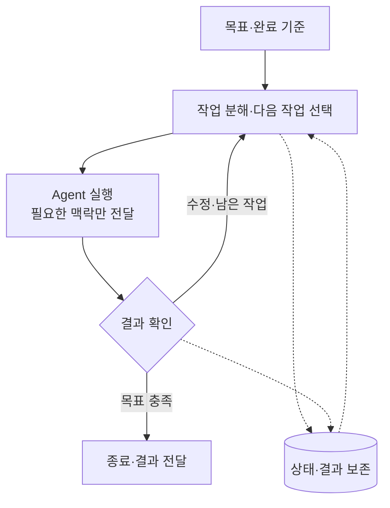

# 오케스트레이션의 최소 구조

외부 사례를 종합하면 핵심은 **목표를 실행 가능한 일로 나누고, 결과에 따라 다음 행동을 이어가는 것**이다. 아래는 특정 도구의 구성도가 아닌 개념 요약이다.

- **조율:** 다음 행동은 agent가 판단하거나 코드·규칙이 결정한다. 별도의 관리자 agent가 반드시 필요한 것은 아니다.
- **실행:** 한 agent를 반복 실행할 수도, 독립적인 작업을 여러 agent에게 병렬로 맡길 수도 있다.
- **기억:** 대화·파일·작업 목록·DB 등으로 상태를 이어받는다. 공유 Task 보드는 선택 가능한 구현이다.
- **검증:** 실행이 끝났다는 사실과 목표를 달성했다는 판단을 구분한다. 판단 불가·한도 초과는 중단하거나 사람에게 넘긴다.

**차이는 조직도가 아니라, 이 순환의 어느 부분을 누가 자동으로 처리하느냐에 있다.**

출처: [LangChain 패턴](https://docs.langchain.com/oss/python/langchain/multi-agent) · [Agent Teams](https://code.claude.com/docs/en/agent-teams) · [Ralph](https://github.com/snarktank/ralph) · [Gas Town](https://github.com/gastownhall/gastown) · [Paperclip](https://github.com/paperclipai/paperclip).

확인일: 2026-09-28. 앞서 읽은 공개 문서의 종합 해석이며, 모든 구현이 각 단계를 자동 보장한다는 뜻은 아니다.
