# 오케스트레이션 방식별 실행 흐름

확인일: 2026-09-28. 목적은 **누가 다음 일을 정하고, 누가 실행하며, 결과를 어디에 남기는지** 비교하는 것이다. 공개 문서와 설치된 Orca CLI 가이드를 이해하기 쉽게 단순화했다. 제품 내부의 모든 상태 전이를 표현한 명세나 실운영 재현 결과는 아니다.

## 읽는 순서와 표기

앞의 **공통점·차이의 핵심·우리에게 중요한 인사이트**로 전체 구조를 읽은 뒤, 현재 방식인 **0번**을 보고, **7번 Orca 단독**과 **8번 기존 결합 모델**을 비교하면 우리 환경에서 무엇이 추가되는지 파악하기 쉽다. 1~6번은 외부 공개 방식이다. 번호는 성숙도나 추천 순위가 아니다.

- 사각형: 사람·agent의 행동 또는 실행 단계.
- 마름모: 다음 경로를 고르는 판단.
- 원통: 실행 사이에 남는 상태·산출물.
- 실선: 요청·결과 또는 실행 순서. 병렬 분기는 별도로 표시한다.
- 점선: 상태 읽기·기록. 자동 동기화를 뜻하지 않는다.
- 검증 단계는 제품별로 설정해야 한다. agent의 성공 보고만으로 제품 품질이 보장되지는 않는다.

| 방식 | 다음 일을 정하는 주체 | 실행 단위 | 주요 상태 위치 | 사람이 주로 맡는 일 |
| --- | --- | --- | --- | --- |
| 0. 직접 세션 운용 | 사용자와 각 세션 | 레포의 작업 세션 | 코드·Task·세션 맥락 | 세션별 요청과 결과 판단 |
| 1. Subagents | 메인 agent | 범위가 작은 위임 작업 | 메인 대화·반환 결과 | 목표와 최종 검토 |
| 2. Agent Teams | lead와 팀원 | 독립 세션의 작업 | 공유 Task·메시지 | 팀 방향 조정·직접 개입 |
| 3. Ralph | 반복 스크립트와 실행 agent | 작은 PRD 항목 | Git·PRD·진척 파일 | 작업 정의·검증 기준·한도 |
| 4. Gas Town | Mayor와 운영 구성요소 | 여러 worker의 작업 | Beads·Git 기반 상태 | 목표·막힌 판단·결과 검토 |
| 5. Custom Workflow | 정의된 분기와 agent 판단 | 흐름의 단계 | 애플리케이션 상태 | 흐름 설계·예외 판단 |
| 6. Paperclip | 실행 트리거와 담당 agent | issue에 연결된 실행 | DB·issue·실행 기록 | 목표·권한·예산·필요한 승인 |
| 7. Orca 단독 | coordinator 세션 | Task의 Dispatch | Run·Task·Dispatch·inbox | 목표·범위·위임 밖 판단 |
| 8. 기존 결합 | PM 세션 | issue와 연결된 Orca 실행 | Paperclip·Orca·제품 Task | 목표·최종 판단 |

## 공통점 — 모두 같은 실행 순환을 서로 다른 방식으로 맡는다

아래는 앞서 확인한 방식들을 비교하기 위한 **공통 분석 틀**이다. 모든 도구가 각 단계를 자동 구현한다는 뜻은 아니다. 직접 세션 운용에서는 사람이, 다른 방식에서는 agent·스크립트·runtime이 일부 역할을 맡는다.

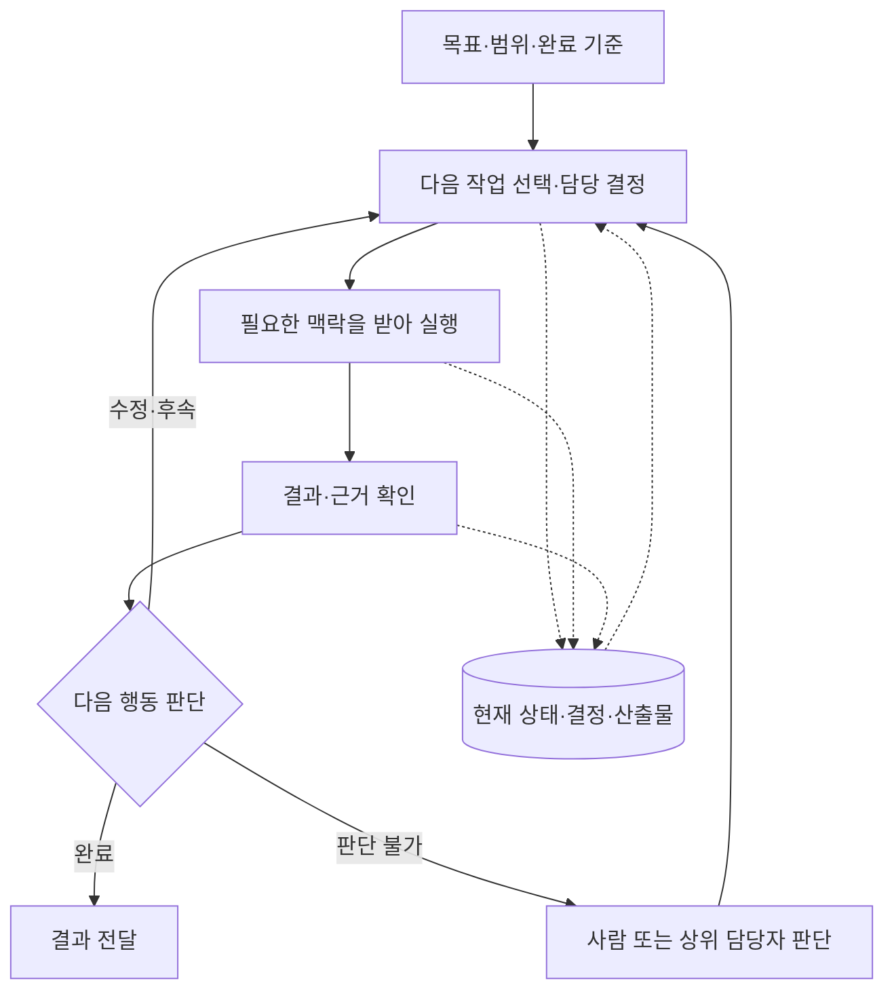

공통 질문은 네 가지다.

1. **다음 행동:** 지금 누가 무엇을 할지 누가 정하는가?
2. **맥락 전달:** 실행자가 목표·제약·기존 결과를 어떻게 받는가?
3. **상태 보존:** 중단하거나 담당자가 바뀌어도 어디서 이어받는가?
4. **결과 판단:** 실행 종료·작업 완료·제품 검증을 누가 구분하는가?

이 네 책임을 한 사람이 맡아도 실행 흐름은 존재한다. 오케스트레이션 도구를 추가하는 효과는 그 책임 중 어떤 부분을 실제로 대신 처리하는지에 달려 있다.

근거: [LangChain 패턴 비교](https://docs.langchain.com/oss/python/langchain/multi-agent), [Ralph](https://github.com/snarktank/ralph), [Paperclip](https://github.com/paperclipai/paperclip) 및 아래 7번의 Orca 실행 계약을 종합한 해석이다.

## 차이의 핵심 — 무엇을 자동으로 맡길 것인가

다음은 기능의 완전한 지원표가 아니라 **각 방식에서 먼저 비교할 지점**이다. 하나의 도구가 여러 가지를 지원할 수 있고, 방식끼리 조합할 수도 있다.

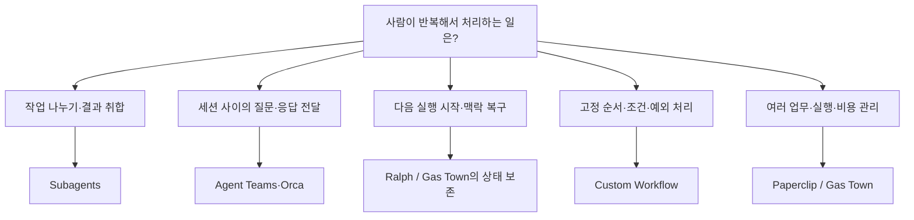

**병렬성·지속성·자율성은 서로 다른 축이다.** 여러 agent가 동시에 일한다고 다음 실행까지 자동으로 이어지는 것은 아니다. 상태가 남는다고 스스로 재개되는 것도 아니다. 반복 실행되더라도 결과의 정확성이 자동 보장되지는 않는다.

예를 들어 Ralph의 반복 루프, Agent Teams의 세션 협업, Orca의 Dispatch 추적은 서로 다른 부담을 줄인다. 따라서 도구 이름이나 agent 수만으로 비교하기보다, 필요한 책임과 제공 기능을 맞춰 봐야 한다.

근거: 각 방식의 아래 상세 흐름 및 연결 출처. 위 분류와 축의 구분은 해당 계약들을 비교한 이 문서의 해석이다.

## 우리에게 중요한 인사이트 — 추가 계층이 실제 부담을 줄이는가

아래는 현재 사용자 설명과 우리 레포의 연결 계약에 근거한 **도입 판단 제안**이다. 효율을 측정해 입증한 결과나 운영 변경 결정은 아니다.

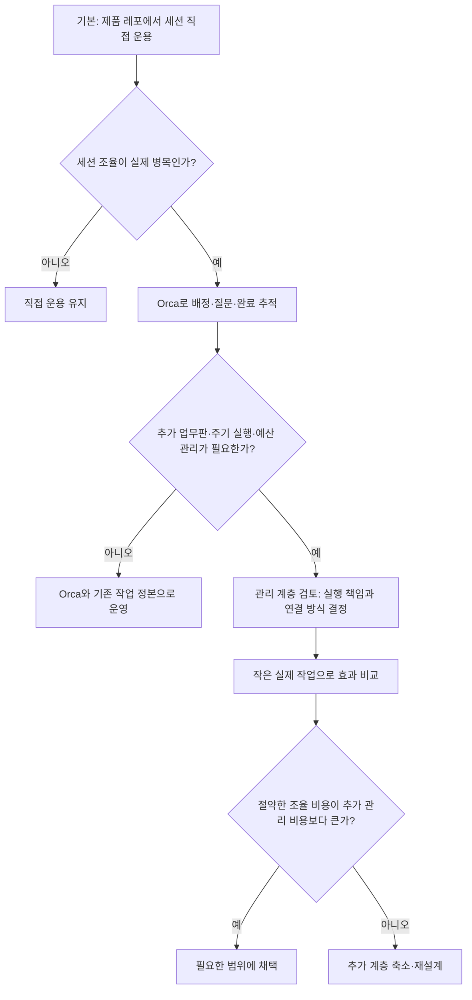

- **Orca 단독으로도 감독 흐름이 있다.** 별도 Paperclip 업무판 없이 Task·Dispatch·질문/응답·완료 보고를 연결할 수 있다. 다음 배정과 제품 판정은 coordinator가 맡는다.
- **도구를 추가하면 연결 책임도 생긴다.** 우리 결합 모델에서는 PM이 Paperclip issue와 Orca 실행 상태를 맞춘다. 자동화로 절약한 일과 이 연결에 드는 일을 함께 비교해야 한다.
- **역할 분리는 맥락 분리나 독립 검증에 기여할 때 유용하다.** 직함의 수보다 실행자가 혼자 처리할 수 있는 작업 경계와 검증 가능한 결과가 중요하다.
- **상태를 한곳에 둔다는 것은 모든 데이터를 한 파일에 넣는다는 뜻이 아니다.** 제품 완료 판단은 Task, 실행 시도는 Dispatch, 산출물은 코드처럼 책임을 나눌 수 있다. 같은 상태를 여러 곳에서 독립적으로 편집할 때의 불일치를 줄이는 것이 목적이다.

작은 비교 실험을 한다면 비슷한 작업에서 **사용자 개입 횟수, 상태를 맞추는 시간, 전체 완료 시간, 검증 후 재작업**을 함께 본다. 속도만 빨라지고 검증이 약해진 결과를 개선으로 계산하지 않는다. 비용을 관측할 수 있으면 모델 사용량도 포함한다.

근거: [우리 실행 연결 계약](../skills/squad-model/references/execution-tools.md), 7번 Orca 가이드, [Agent Teams의 적용 조건](https://code.claude.com/docs/en/agent-teams). 판단 기준과 측정 제안은 이 문서의 종합 의견이다.

## 0. 비교 기준 — 레포에서 세션을 직접 운용

사용자가 설명한 현재 방식을 단순화한 그림이다. 세션 수와 검증 절차를 현재 runtime에서 조회한 것은 아니다.

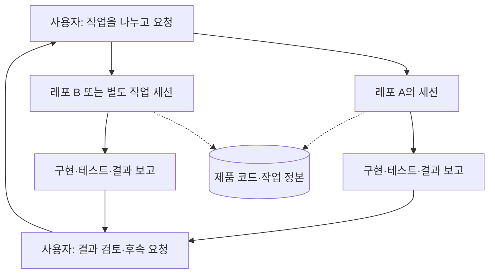

**핵심:** 실행 장소와 대화 상대가 직접 연결된다. 작업 간 조율이 필요할 때 사용자가 전달자 역할을 맡는다. 모든 세션이 같은 파일을 쓰거나 항상 병렬 실행된다는 뜻은 아니다.

## 1. Subagents — 필요한 일만 맡기고 결과 회수

메인 agent가 통제권을 유지하면서 하위 작업을 호출한다. 아래 예시는 조사와 리뷰를 독립적으로 맡기는 경우다.

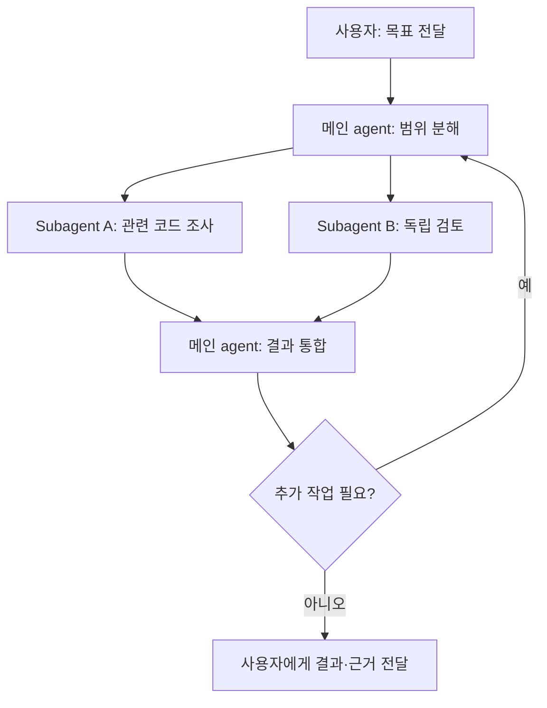

**줄이는 일:** 서로 독립적인 조사·검토를 사람이 하나씩 요청하고 취합하는 일.

**남는 일:** 메인 agent의 범위 분해와 결과 검증. 모든 대화를 각 subagent에 복사하는 대신 필요한 맥락을 골라 전달해야 한다.

출처: [LangChain Multi-agent — Subagents](https://docs.langchain.com/oss/python/langchain/multi-agent). 이 패턴 자체가 특정 회사 조직이나 장기 업무판을 요구하지는 않는다.

## 2. Agent Teams — 독립 세션끼리 협업

lead가 배정과 결과 통합을 맡고, 팀원은 서로 직접 정보를 교환할 수 있다. 사용자가 개별 팀원에게 직접 말하는 경로도 있다.

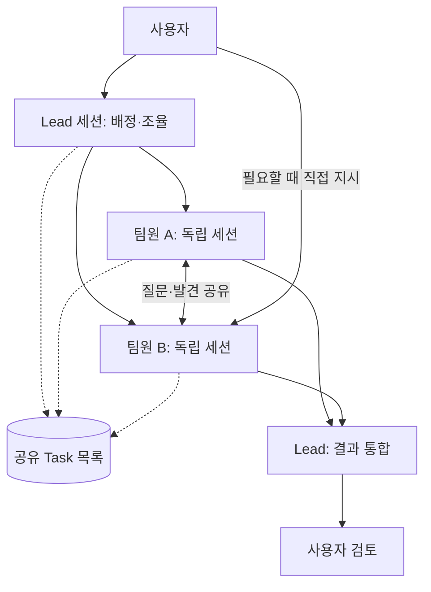

**줄이는 일:** 사용자가 세션 사이에서 질문·발견·작업 상태를 중계하는 일.

**남는 일:** 파일 소유권 분리와 작업 크기 조절. 같은 파일을 동시에 수정하거나 의존성이 촘촘하면 조율 비용이 커진다. 공식 문서상 experimental이며 세션 재개·조율·종료에 알려진 한계가 있다.

출처: [Claude Code Agent Teams](https://code.claude.com/docs/en/agent-teams). 공유 Task 사용은 해당 Task 도구를 가진 세션을 전제로 한다.

## 3. Ralph — 새 실행으로 작은 작업을 반복

여기서는 여러 Ralph 변형 중 `snarktank/ralph`의 흐름을 다룬다. 매 반복은 깨끗한 맥락의 새 실행이며, 이전 결과는 파일과 Git으로 이어받는다.

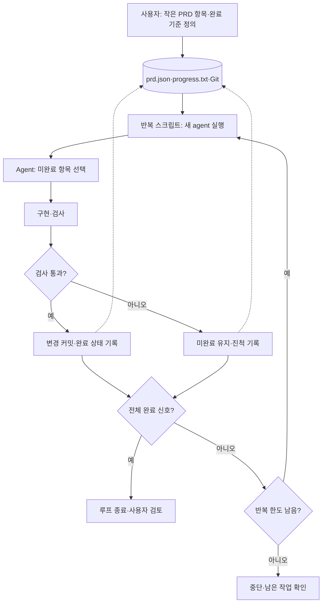

**줄이는 일:** 새 세션을 열고 남은 작업을 계속 지시하는 일.

**남는 일:** 충분히 작은 작업 정의와 신뢰할 수 있는 검사. 완료 신호와 PRD 상태는 agent가 갱신하므로 독립 QA를 자동 보장하지 않는다. 여러 agent가 동시에 협상하는 구조와는 다르다.

출처: [Ralph README 및 실행 파일](https://github.com/snarktank/ralph).

## 4. Gas Town — 여러 worker와 지속되는 작업 상태

여러 레포를 관리하는 workspace manager다. Mayor가 목표를 나누고 worker에 배정하며, 세션이 끝나도 작업 상태를 이어받도록 한다. 아래는 문서의 대표 흐름을 축약한 것이며 모든 운영 역할을 펼친 그림은 아니다.

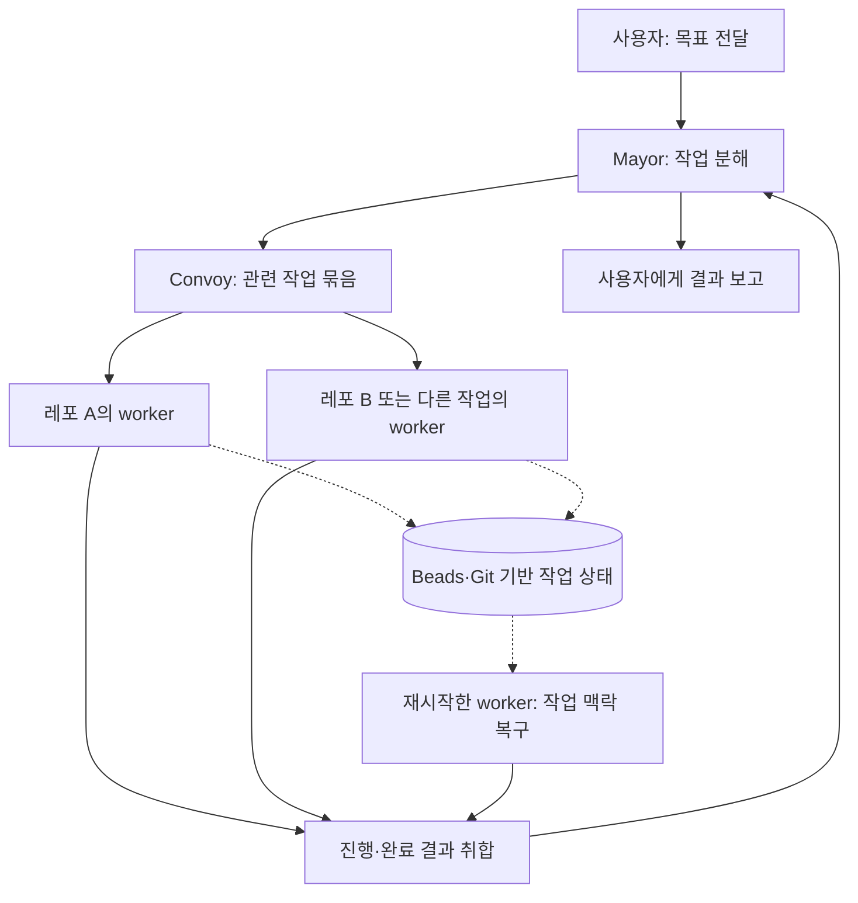

**줄이는 일:** 다수 worker의 배정·진행 추적·세션 교체 때 맥락 복구.

**남는 일:** 전용 작업 원장과 실행 환경 운영. 작업 보존이 곧 충돌 없는 통합이나 제품 검증을 뜻하지 않는다.

출처: [Gas Town](https://github.com/gastownhall/gastown), [Architecture](https://github.com/gastownhall/gastown/blob/main/docs/design/architecture.md). 특정 규모에서의 효율 개선은 이번 문서에서 재현하지 않았다.

## 5. Custom Workflow — 정해진 실행 흐름 안에서 agent 사용

아래는 LangGraph 같은 도구로 구성할 수 있는 **설명용 설계 예시**다. 프레임워크 설치만으로 이 검증·재시도 정책이 생기는 것은 아니다.

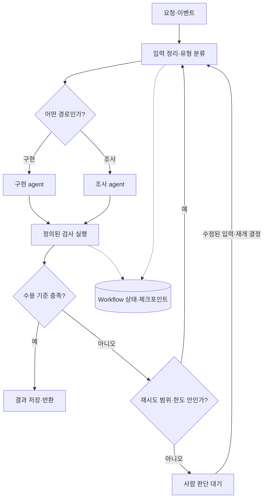

**줄이는 일:** 반복 업무에서 다음 단계·실패 경로를 매번 대화로 결정하는 일.

**남는 일:** 흐름과 상태 저장·재개·외부 효과 중복 방지를 설계하는 개발 비용. 판단은 agent에 맡겨도 순서와 검증은 코드로 제한할 수 있다.

출처: [LangChain Multi-agent — Custom workflow](https://docs.langchain.com/oss/python/langchain/multi-agent). 점선의 저장 범위와 사람 개입은 구현자가 선택하는 구성이다.

## 6. Paperclip — 업무판과 실행을 한 시스템에서 관리

Paperclip 공개 문서의 실행 대기열·adapter·issue 흐름이다. 우리 로컬 설치에서 이 기능들을 모두 활성화했다는 뜻은 아니다.

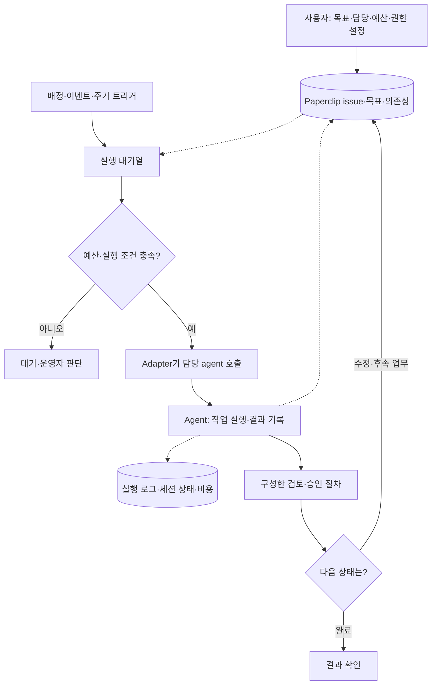

**줄이는 일:** 업무 상태·실행 시작·비용·실행 이력을 여러 도구에서 맞추는 일.

**남는 일:** agent가 수행할 수 있는 작업 정의, adapter 구성, 제품별 검증. 모든 issue에 독립 QA나 사용자 승인이 기본 강제된다는 의미는 아니다.

출처: [Paperclip 공식 README](https://github.com/paperclipai/paperclip). 현재 공개 설명과 이 레포에 고정한 설치 버전은 별도 대상이다.

## 7. Orca 단독 — coordinator가 감독하고 runtime이 실행 이력을 관리

**우리 Orca 스킬에도 이 계층이 이미 있다.** Paperclip 없이 Run·Task·Dispatch·질문/응답·완료 보고를 사용할 수 있다. coordinator는 실제 agent 세션이며, Run은 지속되는 이름 공간과 inbox다. **Run을 만들었다고 자동으로 다음 worker가 배정되지는 않는다.**

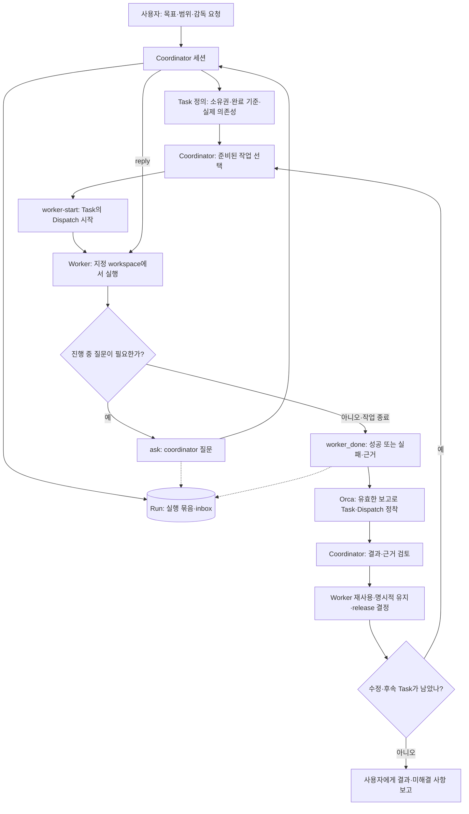

**Task와 Dispatch의 차이:** Task는 해야 할 일, Dispatch는 그 일을 수행하는 한 번의 권위 있는 시도다. 질문·완료 보고가 어떤 시도에서 왔는지 확인할 수 있다.

**자동으로 처리하는 부분:** worker 시작 시 배치·준비·지시 주입, 메시지 저장, 유효한 `worker_done`에 따른 Task·Dispatch 정착 등.

**Coordinator가 판단하는 부분:** 작업 분해, 준비된 작업 선택, 질문 답변, 제품 검증, 수정·후속 배정과 worker 처리. 실패 시도 뒤 재시작과 정리는 가이드의 권한·복구 조건을 따라야 한다. timeout·응답 없음은 종료 증거가 아니다.

독립 작업들은 기다리기 전에 함께 시작할 수 있다. 이 그림은 가독성을 위해 worker 경로 하나만 그렸다. 제품 검증 실패 시 새 수정 Task/Dispatch를 구성하며, runtime 성공 상태를 곧 제품 완료로 읽지 않는다.

### 감독 없는 인계는 별도 흐름

단순히 다른 세션에 소유권을 넘기는 경우에는 orchestration Run·Task·Dispatch를 만들지 않는다.

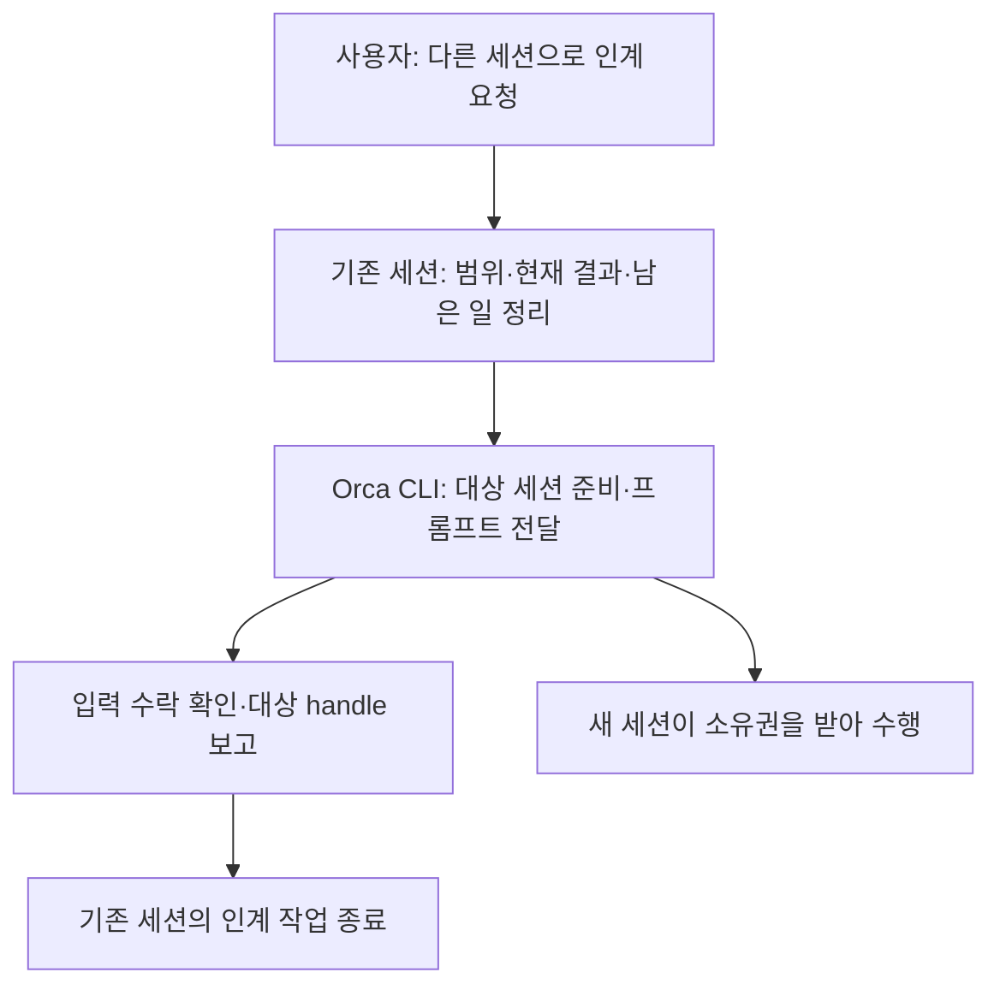

입력 수락은 작업 완료 증거가 아니다. 기존 세션이 결과를 끝까지 감독하는 흐름과 구분한다.

출처: 설치 CLI에서 읽은 `orca skills get orchestration`, `orca skills get orchestration --reference references/coordinator-loop.md`, `orca skills get orca-cli` (2026-09-28). [Orchestration 스킬 진입점 · 로컬 의존성](external-dependencies.md#local-8), [Orca CLI 스킬 진입점 · 로컬 의존성](external-dependencies.md#local-9). 진입 파일은 stub이며 실제 계약은 CLI에서 제공한다. 이번 작업에서는 가이드만 읽고 worker를 실행하지 않았다.

## 8. 우리 레포의 결합 — Paperclip 업무판 + Orca 실행 + PM 연결

이 레포에 기록된 결합 모델이다. 6번의 Paperclip 직접 실행 흐름과 달리, 직무 실행을 Orca가 맡고 PM이 두 도구를 연결한다.

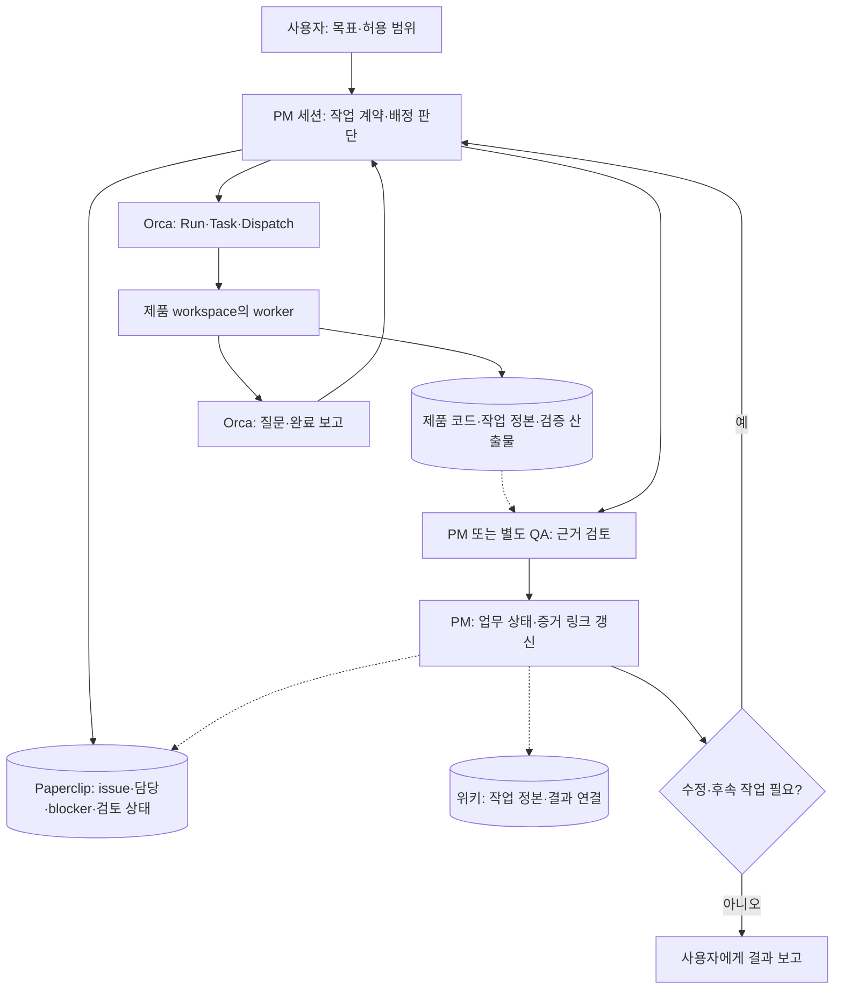

**7번에서 추가된 것:** Paperclip 업무판과 제품·위키 기록 사이의 연결. PM이 issue와 Orca 실행의 관계를 유지한다.

**자동이라고 보면 안 되는 것:** 두 도구의 상태 동기화, 모든 공유 자원의 충돌 차단, PM 세션 없이 진행되는 상시 루프. 기존 문서는 이것들을 구현·검증 완료로 주장하지 않는다.

출처: [실행 도구 연결](../skills/squad-model/references/execution-tools.md), [운영 모델과 위키 연결](task-session-model.md). 제품 Task와 위키 Task의 현재 소유권은 운영자의 중앙 규약을 따른다. 이 그림은 별도 편집 정본을 추가하라는 제안이 아니다.

## 비교해서 볼 질문

1. **세션 사이의 메시지 전달이 귀찮은가?** 2번과 7번의 질문·결과 전달을 본다.
2. **계속 다음 작업을 시작시키는 게 귀찮은가?** 3번의 반복 실행을 본다.
3. **반복 업무의 순서와 실패 처리를 고정하고 싶은가?** 5번의 분기·검증을 본다.
4. **여러 레포와 많은 worker를 장기간 운영해야 하는가?** 4번과 6번의 상태 관리 범위를 본다.
5. **우리 결합 모델의 추가 계층이 필요한가?** 7번에서 8번으로 갈 때 생기는 기록·연결이 실제로 어떤 일을 덜어주는지 본다.

위 질문은 이 문서의 비교 관점이다. 설치나 운영 방식 변경을 결정한 것은 아니다.
