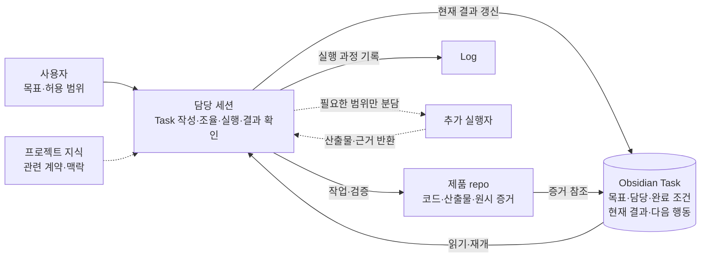
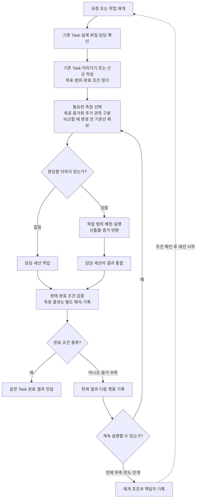
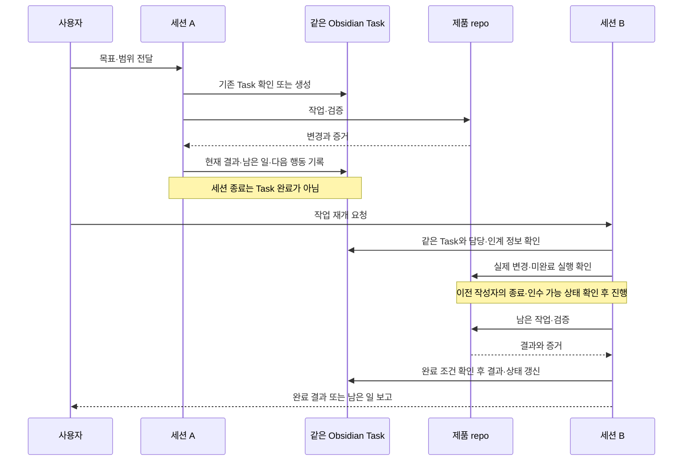

# Obsidian Task 기반 운영 모델

운영 절차의 정본이다. 기본 단위는 **중앙 Task 하나 + 담당 세션 하나**이며, 세션이 Task를 읽고 실행·검증·갱신한다. 기본 절차는 수동 실행이며, 자동 배정·실행 복구가 필요하면 선택적인 [compact scheduler](project-scheduler.md)를 사용한다. Markdown 작성자 간 동시 쓰기 잠금은 제공하지 않는다.

## 시작과 Task 생성

세션은 Obsidian vault 또는 대상 제품 repo에서 시작할 수 있다. Obsidian에서 시작하면 기존 프로젝트 등록부의 repo·중앙 문서 위치와 프로젝트 index로 대상을 식별한다. 해당 제품 repo의 AGENTS와 운영자의 공통 진입점을 읽고 실제 프로젝트·Task 위치·활성 담당을 확인한다. 기존 업무는 같은 Task를 이어가고, 새 목표이면 요청을 받은 세션이 목표·범위·완료 조건을 작성한다. 단순 질문까지 Task로 만들지는 않는다.

여러 세션을 vault에서 시작하더라도 각 세션의 대상 repo·Task·담당 범위를 명시한다. 현재 harness는 한 세션의 workspace를 고정한다. vault 세션은 프로젝트 탐색·조회·조율을 맡고, 제품 코드 변경은 해당 repo에서 시작한 실행 세션에 연결한다. 실행 세션은 자신의 실제 식별자를 제품 Task에 바인딩하고 변경을 기록한다. 코드·테스트 명령은 제품 repo, 중앙 기록 명령은 vault에서 실행한다. 단순한 디렉터리 전환으로 hook의 기록 대상이 바뀌었다고 추정하지 않는다. 프로젝트 프로필은 지속적인 맥락과 지침 연결만 소유하고 현재 담당·진행 상태는 Task에 둔다.

사용자는 목표·우선순위·허용 범위를 정한다. 담당 세션이 조율과 실행을 겸하며, 맡긴 범위 안에서는 매 단계 재승인을 요구하지 않는다. 범위 밖 결정이나 실행에 필요한 정보가 없을 때 해당 결정·위치만 확인한다.

새 clone에는 운영자의 개인 위키나 자동 등록 기능이 포함되지 않는다. 공통 AGENTS·위키, 선택적 `AGENTS.local.md`, 제공된 `PRODUCT_WORKFLOW_FILE`은 외부 의존성이며 실제 위치와 접근 가능 여부를 확인한다. 제품별 규칙을 다른 제품에 자동 상속하지 않는다.

요청 예시: “프로젝트 지침과 기존 Task·담당을 확인하고 이 목표를 진행해줘. 완료 조건을 정하고 필요한 지표만 함께 확인해줘.”

## 정보와 갱신 책임

| 정보 | 유일한 소유 위치 | 갱신 책임 |
| --- | --- | --- |
| 목표·범위·담당·상태·완료 조건·현재 결과·다음 행동·증거 연결 | 같은 중앙 Task | 해당 Task 담당 세션 |
| 제품 계약·재사용 지식 | 프로젝트 지식 정본 | 해당 문서 담당 |
| 코드·설계 원본·원시 검증 산출물 | 제품 repo | 배정된 실행자 |
| 변경 과정·이전 원문·실행 이력 | Log | 실행한 세션 |
| 세션·worker 실행과 메시지 | 필요할 때 Orca 등 실행 도구 | 실행 담당; 업무 상태는 중앙 Task로 연결 |

프로젝트 index로 맥락을 찾고 Task의 `Goal`, `Scope`, `Acceptance Criteria`, `Current Result`, `Next Action`, 의존 관계와 evidence로 업무를 이어간다. 로컬 `tasks/`는 필요할 때 중앙 Task를 연결하는 용도다. 별도 progress 문서나 도구 보드를 두 번째 업무 상태 정본으로 편집하지 않는다. 검증된 지속 지식은 `docs/`, 미확정 아이디어는 `.ideas/`에 둔다. 로컬 Task 기록과 `AGENTS.local.md`는 Git에 강제로 추가하지 않는다.

## 실행과 선택적 분담

Task 전체와 실제 파일·실행 소유권을 대조한 뒤 필요한 지식만 읽고 작업한다. 검증 결과와 남은 일은 같은 Task에 반영한다. 완료·상태·기록의 공통 절차는 [공통 작업 규약 · 로컬 의존성](external-dependencies.md#local-4)이 소유한다. 문서 검사나 실행 종료 자체가 제품 완료의 증거는 아니다.

측정 선택·비교 조건·결과 해석·Task 기록 양식은 [BE·FE 측정 기준](engineering-measurement.md)을 따른다.

독립 결과·담당·완료 판단 또는 실제 선행 관계가 있고 분담 이득이 있을 때만 자식 Task를 만든다. FE·BE 직군이나 지표 개수만으로 나누지 않는다. 조율 담당은 시작 전에 계약·파일·공유 자원 경계를 정한다. 실행자는 산출물과 증거를 반환하고, 부모 담당 한 명이 통합 결과를 확인하여 부모 Task를 갱신한다. 자식 담당은 자기 Task만 소유한다. 별도 상시 PM Agent는 필요하지 않다.

## 세션 인계와 재개

이전 담당은 현재 결과·남은 일·증거·다음 행동과 인수 주체를 남긴다. 인수자는 실제 변경·미완료 실행과 이전 작성자의 종료 또는 분담 상태를 확인한다. 예기치 않은 중단도 실제 상태부터 대조하며 갱신 시각만으로 인수를 추정하지 않는다. 기존 담당이 작업 중이거나 소유권을 확인할 수 없으면 같은 범위의 두 번째 작성자를 시작하지 않는다.

세션마다 새 Task를 만들지 않는다. Task 갱신은 자동 실행을 유발하지 않으며 기본 구성에서는 사용자가 세션을 시작한다. Markdown만으로 원자적 선점·동시 쓰기 방지가 보장되지 않는다.

## 메인 감독과 worker 질문·재개·완료

메인 세션이 worker를 감독할 때도 정본은 기존 Task다. 메인은 배정 전에 Task·범위·담당을 정하고, worker는 실제 session ID를 Task에 바인딩한 뒤 같은 Task에서 작업한다. 질문·답변·막힘·완료는 Task에 append한 Markdown 항목과 SQLite 참조 이벤트로 주고받는다. 본문은 Task에, 전달·처리 상태와 ACK만 원장에 둔다.

1. worker가 질문 항목을 추가하고 `ref publish --kind question.opened`를 실행한 뒤 답을 기다리는 동안 그 Task를 쓰지 않는다.
2. 메인이 `ref wait`로 받아 `read`·`processed`·`ack`를 기록하고, 답변 항목을 추가해 `question.answered`를 publish한다.
3. worker가 `ref wait`로 답을 받아 hash 검증된 본문을 적용하고 `processed applied`·`ack`를 기록한 뒤 작업을 재개한다. 막히면 `work.blocked`, 끝나면 `work.completed`를 보낸다.
4. 메인이 완료 이벤트를 받아 실제 결과를 검토하고 Task 수용을 결정한다. ACK는 처리 기록이지 Task 완료가 아니다.

명령·상태·hash 규칙은 [Task 항목 참조 이벤트](scheduler-task-events.md)가 소유한다. 전달은 pull 방식이라 수신자가 활성 세션에서 `wait`를 실행해야 한다. Task 수정만으로 이벤트가 publish되지 않는다. 수신 실행이 `orca:<terminal handle>`이면 `ref publish --wake`로 유휴 terminal에 고정 문구 한 번을 보낼 수 있다. 이 wake는 best effort이며 유휴 메인의 실제 재개는 미검증이다([wake](scheduler-task-events.md#유휴-orca-수신자-wakebest-effort)). 승인 대기 감지 hook과 일반 TUI·scheduler attempt의 통합은 없다. 진행 조회는 [`watch`](project-scheduler.md#터미널-진행-조회-watch)가 맡는다. 실제 왕복은 Claude·Kiro worker에서 성공했고 Codex worker는 readiness 확인 실패로 검증되지 않았다([검증 범위](project-scheduler-validation.md#task-item-reference-events)).

## 적용 범위와 근거

여러 Task 선택에는 우선순위·선행 조건·실제 담당 확인이, 병렬 실행에는 충돌 제어·결과 통합이, 자동 재개에는 별도 트리거·중복 실행 방지·중단/복구 정책이 추가로 필요하다. 선택적인 [compact scheduler](project-scheduler.md)는 공유 원장의 단일 슬롯, 이벤트·실행 복구와 제한된 LLM 재계획을 구현한다. 자동 실행을 선택하지 않은 기본 세션 흐름에는 이 프로세스가 필요하지 않다.

기존 도구에 활성 업무가 있으면 담당·상태·증거와 업무별 정본을 먼저 확인한다. 기존 데이터나 제품별 채택 모델을 자동 전환하지 않는다. `skills/squad-model/`은 이전 역할 중심 구성으로, 재사용할 때 현재 모델과의 호환을 따로 확인한다.

- [외부 사례의 최소 실행 순환](orchestration-core.md): 설계에 참고한 공통 개념과 출처.
- [문서 생애주기 · 로컬 의존성](external-dependencies.md#local-10): 현재 내용과 보존 이력의 책임.
- [현재 작업·검증 결과 · 로컬 의존성](external-dependencies.md#local-2): 실제 확인 범위와 미검증 동작의 정본.
- [현재 harness 구현 범위 · 로컬 의존성](external-dependencies.md#local-11): 탐색·기록·문서 검사 구현.
