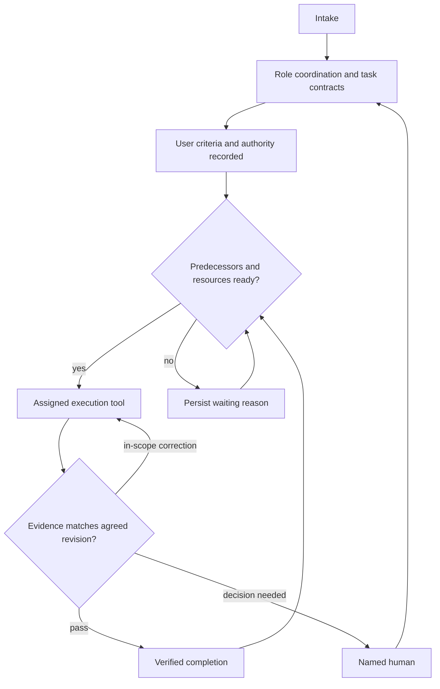

# Task contract v1

Status: repository pilot convention, not an organization-wide policy.

Detailed [role contracts](roles.md) and the [handoff record](handoff.md) supplement
this v1 format without changing its identifiers, hash algorithm or five fixtures.
See [design tools](design-tools.md) for the verified tool chain and its limits.

| Role | Input | Output and verification |
| --- | --- | --- |
| PM/planning | Intake evidence, user outcome, constraints | Scope, behavior contract, decomposition, criteria and authorization references |
| Design | Approved behavior, user context | Flow/states and reviewable artifact; check actual rendering and edge states |
| Development | Approved contract and design dependencies | Implementation and reproducible checks; report environment and remaining limitations |
| Verifier / user | Contract revision and evidence | Pass, in-scope correction, or human decision; separate authored work from independent review |

Roles may be performed by one executor. Mark self-review honestly. The user owns
product decisions; the coordinator advances only the authorized work.

Each task stores:

- `task_id`: immutable local identifier, never reused after cancellation.
- `role`, `title`, `depends_on`: responsibility and predecessor IDs.
- `contract`: `revision`, observable `acceptance`, `verification`, `authority`
  (allowed effects, exclusions, budget), `resources` (`key`, `mode`: read/write),
  and `decision` (proposed/agreed, human and evidence reference).
- `criteria_hash`: SHA-256 of UTF-8 JSON of `contract`, sorted keys, no whitespace,
  Unicode unescaped. Thus authority/resources/revision changes also invalidate it.
- `evidence`: artifact reference, checked revision/hash, result and verifier.
- Paperclip issue UUID/identifier mapping is local runtime data, not the stable ID.

An agreed contract plus verified predecessors and nonconflicting resources makes
work eligible. Eligibility is a coordinator decision, not something this JSON
automatically enforces. Read/read can overlap; same-key write conflicts serialize.
Keys must describe the actual shared resource, including DB/environment and file
ownership. Different worktrees do not isolate a shared database.

## Paperclip mapping (2026.831.1)

| Model | Paperclip surface | Boundary |
| --- | --- | --- |
| Outcome / task grouping | goals, projects, parentId | No automatic quality guarantee |
| Task identity | issue UUID plus stable ID in description | Do not encode order in a hash |
| Predecessors | blockedByIssueIds | Use structured relations, not only comments |
| Criteria / evidence | Description contract + revision-specific comments/artifacts | Automatic stale-evidence invalidation is not verified |
| Review / approval | Optional executionPolicy stages with participants | Configure explicitly; default is not mandatory review |
| Human escalation | responsibleUserId / createdByUserId, maxReviewRounds | Default rounds 3 in source; no human means escalation cannot target one |
| Parallel execution | Paperclip wakeups and run ownership | Cross-app resource locks remain a coordinator convention |
| Isolated workspaces | Experimental enableIsolatedWorkspaces | Off in this pilot; no implicit opt-in or sandbox bypass |

`examples/pilot.json` is a synthetic proposal: contract → design/development in
parallel → integration → user review. It grants no real product execution.
The contract validator checks records, not scheduler readiness or product quality.

## Decisions still open

Real pilot subject, role-to-model assignments, paid usage cap, retry/time budgets,
independent reviewer, resource lock enforcement and criteria-change invalidation
automation require evidence from a subsequent bounded pilot. Do not infer these
from the sample. Installation and deterministic checks do not validate LLM judgment.
