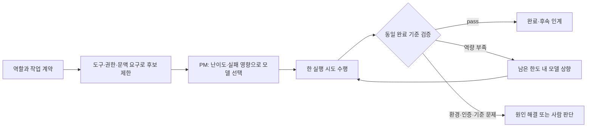

# 작업 난이도에 따른 모델 선택

Status: 조사 완료 · PM 배정 운영안 · 자동 router 미설치
Checked: 2026-09-10

## 목표와 범위

역할과 모델을 고정하지 않는다. PM·기획·디자인·개발·QA·마케팅·HR 모두
작업의 난이도, 필요한 도구, 실패 영향, 검증 가능성에 따라 실행 모델을 선택한다.
이번 범위는 공개 소스 조사와 이 프로젝트의 배정안이다. 새 유료 API나 상시 gateway는 기동하지 않는다.

## 조사 결과

| 후보 | 공식 자료에서 확인한 기능 | 우리 환경의 적용 경계 |
| --- | --- | --- |
| [RouteLLM](https://github.com/lm-sys/RouteLLM) | 강한/가벼운 모델 쌍을 학습 router와 보정된 threshold로 선택. Python controller와 OpenAI 호환 서버, Apache-2.0 | 단일 요청 중심의 비교 실험 후보. 기본 MF·SW ranking은 임베딩용 OpenAI API key가 필요하다. 기존 Codex 로그인 세션과 직접 연결되었다고 볼 수 없다. |
| [LLMRouter](https://github.com/ulab-uiuc/LLMRouter) | KNN 등 여러 router의 학습·평가·추론, multi-round/agentic 선택, 자체 데이터와 평가 지표 지원 | 우리 작업 기록으로 선택기를 비교할 때 후보. 학습 데이터·모델별 결과가 필요하며 Orca dispatch 연결은 별도 검증 대상이다. |
| [vLLM Semantic Router](https://github.com/vllm-project/semantic-router) | 요청 신호와 정책에 따른 다중 모델 경로, Apache-2.0 | API gateway를 운영할 때 후보. [SAAR](https://vllm-project.github.io/2026/06/02/session-aware-agentic-routing.html)는 도구 호출과 provider 상태의 연속성을 고려해 전환을 제한한다. 현재 Codex 세션을 자동 전환하는 연결은 미검증이다. |

Inference: 현재는 PM이 기존 실행 도구의 모델 선택 기능을 사용하는 것이 가장 작은 적용이다.
공개 benchmark의 절감률이나 모델 순위를 우리 제품 작업의 품질·비용으로 일반화하지 않는다.

## 배정 운영안

| 작업 특성 | 시작 후보군의 판단 |
| --- | --- |
| 명확한 문서 정리·작은 수정·결정된 검사 실행 | 필요한 도구를 쓸 수 있는 가벼운 모델 |
| 여러 파일 구현·통상적인 설계·근거 종합 | 일반 실행 모델 |
| 모호한 문제 정의·분산 동시성·인증 경계·반복 실패 원인 분석 | 강한 추론 모델 |

모델 이름과 군별 매핑은 실제 사용 가능 목록·작업 결과로 확인한다. 프롬프트 길이나
직군만으로 난이도를 판정하지 않는다. 디자인은 이미지/Pencil 지원, 개발은 코드·도구 실행처럼
필수 능력이 먼저다. 가벼운 모델도 완료 기준은 동일하며 QA의 독립성은 모델 크기와 별개다.

각 실행 시도에는 `task_id`, 계약 revision/hash, 역할, 선택한 모델·reasoning effort,
선택 이유, 시간·재시도 한도, 결과·실제 소요를 연결한다. 계약 v1과 5개 샘플은 변경하지 않는다.
모델 선택만 바뀌면 새 실행 시도로 기록한다. 권한·비용 한도가 바뀌면 계약 변경을 검토한다.
도구 호출 도중 임의 교체하지 않고, 명시적인 인계와 검증 가능한 체크포인트에서 재선택한다.
환경 장애를 강한 모델의 반복 호출로 해결하려 하지 않는다.

## 현재 적용과 후속 검증

- Laughtale V2 개발·QA 시도는 모델 선택 근거 없이 기본 Astra로 시작한 상태다.
  실행 중인 시도를 중복 기동하지 않으며, 이 사실을 난이도 기반 배정 성공으로 기록하지 않는다.
- 다음 배정부터 PM이 선택 이유를 기록한다. 이는 coordinator 관행이며 자동 강제는 아니다.
- 자동화 후보 평가는 같은 완료 기준의 대표 작업으로 첫 통과율·재작업·총 소요·측정 가능한
  비용을 비교한다. 구독 사용량과 API 비용을 혼동하지 않고, 관측 불가 비용은 unknown으로 둔다.
- router 설치·Codex/Orca 연동, 모델별 보정 데이터, 비용 절감 효과는 미검증이다.
