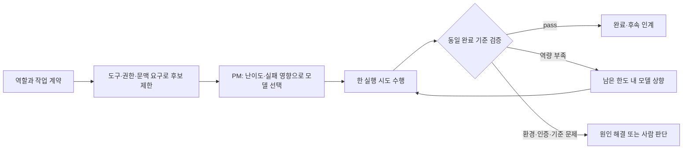

# 작업 난이도에 따른 모델 선택

Status: 후보 조사 · agent용 플러그인 추가 확인 · 자동 router 미설치
Checked: 2026-09-10

## 목표와 범위

역할과 모델을 고정하지 않는다. PM·기획·디자인·개발·QA·마케팅·HR 모두
작업의 난이도, 필요한 도구, 실패 영향, 검증 가능성에 따라 실행 모델을 선택한다.
이번 범위는 공개 소스 조사와 이 프로젝트의 배정안이다. 새 유료 API나 상시 gateway는 기동하지 않는다.

## 조사 결과

| 후보 | 공식 자료에서 확인한 기능 | 우리 환경의 적용 경계 |
| --- | --- | --- |
| [RouteLLM](https://github.com/lm-sys/RouteLLM) | 강한/가벼운 모델 쌍을 학습 router와 보정된 threshold로 선택. Python controller와 OpenAI 호환 서버, Apache-2.0 | 단일 요청 중심의 비교 실험 후보. 기본 MF·SW ranking은 임베딩용 OpenAI API key가 필요하다. 기존 Codex 로그인 세션과 직접 연결되었다고 볼 수 없다. |
| [LLMRouter](https://github.com/ulab-uiuc/LLMRouter) | KNN 등 여러 router의 학습·평가·추론, multi-round/agentic 선택, 자체 데이터와 평가 지표 지원 | 우리 작업 기록으로 선택기를 비교할 때 후보. 학습 데이터·모델별 결과가 필요하며 Orca dispatch 연결은 별도 검증 대상이다. |
| [vLLM Semantic Router](https://github.com/vllm-project/semantic-router) | 요청 신호와 정책에 따른 다중 모델 경로, Apache-2.0 | API gateway를 운영할 때 후보. [SAAR](https://vllm-project.github.io/2026/06/02/session-aware-agentic-routing.html)는 도구 호출과 provider 상태의 연속성을 고려해 전환을 제한한다. 현재 Codex 세션을 자동 전환하는 연결은 미검증이다. |

## Agent 실행을 직접 배정하는 후보 · 조사 교정

앞 조사에서 API router에 치우쳐 PM의 수동 선택을 먼저 권한 것은 성급했다.
다음 프로젝트는 agent 위임 자체에 선택·상향·검증을 연결하므로 우선 비교 대상이다.

| 후보 | 공식 저장소에서 확인 | 적용 경계 |
| --- | --- | --- |
| [Gearbox](https://github.com/Adityaraj0421/gearbox) | Claude Code 플러그인. 작업별 Haiku/Sonnet/Opus 하위 agent 배정, 실패 시 상향, 독립 verifier, 위임 결과 기록 | 주 세션 모델은 변경하지 않는다. hook과 주입된 정책을 사용하며 실제 정책 준수 확인이 필요하다. Codex 어댑터는 확인하지 못했다. |
| [opencode-model-router](https://github.com/marco-jardim/opencode-model-router) | OpenCode 플러그인. 작업 분류에 따른 fast/medium/heavy 위임, 복합 작업 분리, provider fallback, 완료 계약과 검증 | 검증 enforcement 기본값은 advisory이며 enforced와 다르다. Orca/Codex 직접 연결은 미검증이다. |

Inference: API gateway 설치보다 위 agent용 플러그인의 선택·위임 경로를 먼저 비교한다.
PM의 역할 책임과 task별 실행 모델을 분리하는 방향은 유지하되, 수동 선택만 가능하다고 보지 않는다.
설치·실행 검증 전에는 저장소가 설명하는 기능과 우리 runtime에서 확인한 기능을 구분한다.
공개 benchmark의 절감률이나 모델 순위를 우리 제품 작업의 품질·비용으로 일반화하지 않는다.

## 배정 운영안

### Gearbox 0.2.3 소스·hook 검토

검토 고정점: [4105087](https://github.com/Adityaraj0421/gearbox/tree/4105087bfe576837295c9075a09fe1c92e385f57), MIT.
설치나 실제 모델 호출 없이 Python 표준 라이브러리 hook을 임시 디렉터리에서 합성 이벤트로 시험했다.

| 확인 항목 | 결과·우리 적용 판단 |
| --- | --- |
| 모델 선택 | SessionStart가 routing.md를 문맥에 주입하고 coordinator가 명시적 model/subagent_type을 전달한다. 학습 selector는 현 구현이 아니다. |
| 자동 강제 | PreToolUse는 escalation marker를 기록하며 부적절한 모델 배정을 차단하지 않는다. generic proxy를 넣어도 종료 코드 0, fallback=true 기록을 재현했다. |
| 검증 귀속 | A, B를 순서대로 배정한 뒤 A 검증을 보내도 최신 미검증 B에 귀속됐다. task ID 대신 같은 session의 최근 T1/T2를 찾는 휴리스틱이다. 병렬 성과 측정에 그대로 사용 불가. |
| verifier 식별 | 이름에 verifier가 포함된 다른 agent도 기록된다. custom-verifier 이벤트가 verdict를 생성하는 것을 재현했다. 정확한 gearbox namespace 강제와 다르다. |
| 상향 기록 | 정해진 escalation marker가 있을 때 기록되는 것을 확인했다. marker 누락은 자동 추론하지 않는다. |
| 기존 dirty 변경 | BASELINE은 git status 목록을 coordinator가 전달하는 관행이다. 이미 dirty인 같은 파일의 추가 변경을 정확히 분리하는 snapshot은 아니다. |
| 권한·도구 | verifier의 read-only는 지침이며 Bash를 사용할 수 있다. .pen·UIBowl 등 직무 도구 연결과 우리 권한 계약을 대신하지 않는다. |
| telemetry | prompt 앞 200자, cwd, session, usage를 로컬 JSONL에 기록한다. 우리 repo에는 로그를 올리지 않는다. |
| effort | ultrathink 문구의 전파는 upstream도 실험 상태로 표시한다. Codex reasoning effort 연결 검증은 없다. |

Code: [routing policy](https://github.com/Adityaraj0421/gearbox/blob/4105087bfe576837295c9075a09fe1c92e385f57/routing/routing.md),
[hooks](https://github.com/Adityaraj0421/gearbox/blob/4105087bfe576837295c9075a09fe1c92e385f57/hooks/hooks.json),
[verdict correlation](https://github.com/Adityaraj0421/gearbox/blob/4105087bfe576837295c9075a09fe1c92e385f57/hooks/scripts/log-verdict.py).

판단: Claude Code 안에서 쓰는 난이도별 위임 플러그인으로는 유용한 후보다.
현재 Orca/Codex에 직접 설치되는 플러그인은 아니다. 검증·성과 귀속은 기존 task/dispatch ID와
criteria revision/hash를 정본으로 유지해야 한다. Claude Code 단일 제한 작업의 설치 검증 또는
선택 규칙의 Orca adapter 적용이 다음 후보이며, 이번 검토에서 어느 쪽도 구현·기동하지 않았다.
새 scheduler는 필요하지 않다. 학습 router·비용 절감·실제 모델 선택 품질은 미검증이다.

| 작업 특성 | 시작 후보군의 판단 |
| --- | --- |
| 명확한 문서 정리·작은 수정·결정된 검사 실행 | 필요한 도구를 쓸 수 있는 가벼운 모델 |
| 여러 파일 구현·통상적인 설계·근거 종합 | 일반 실행 모델 |
| 모호한 문제 정의·분산 동시성·인증 경계·반복 실패 원인 분석 | 강한 추론 모델 |

모델 이름과 군별 매핑은 실제 사용 가능 목록·작업 결과로 확인한다. 프롬프트 길이나
직군만으로 난이도를 판정하지 않는다. 디자인은 이미지/Pencil 지원, 개발은 코드·도구 실행처럼
필수 능력이 먼저다. 가벼운 모델도 완료 기준은 동일하며 QA의 독립성은 모델 크기와 별개다.

각 실행 시도에는 `task_id`, 계약 revision/hash, 역할, 선택한 모델·reasoning effort,
선택 이유, 시간·재시도 한도, 결과·실제 소요를 연결한다. 계약 v1과 5개 샘플은 변경하지 않는다.
모델 선택만 바뀌면 새 실행 시도로 기록한다. 권한·비용 한도가 바뀌면 계약 변경을 검토한다.
도구 호출 도중 임의 교체하지 않고, 명시적인 인계와 검증 가능한 체크포인트에서 재선택한다.
환경 장애를 강한 모델의 반복 호출로 해결하려 하지 않는다.

## 현재 적용과 후속 검증

- Laughtale V2 개발·QA 시도는 모델 선택 근거 없이 기본 Astra로 시작한 상태다.
  실행 중인 시도를 중복 기동하지 않으며, 이 사실을 난이도 기반 배정 성공으로 기록하지 않는다.
- 다음 배정부터 PM이 선택 이유를 기록한다. 이는 coordinator 관행이며 자동 강제는 아니다.
- 자동화 후보 평가는 같은 완료 기준의 대표 작업으로 첫 통과율·재작업·총 소요·측정 가능한
  비용을 비교한다. 구독 사용량과 API 비용을 혼동하지 않고, 관측 불가 비용은 unknown으로 둔다.
- router 설치·Codex/Orca 연동, 모델별 보정 데이터, 비용 절감 효과는 미검증이다.
